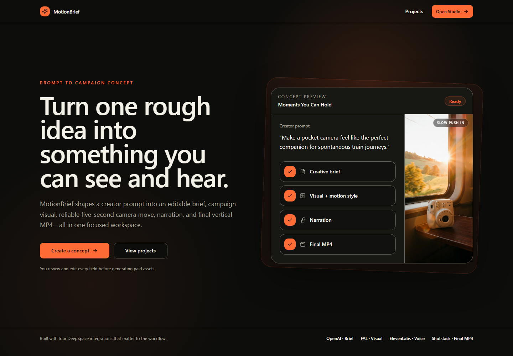
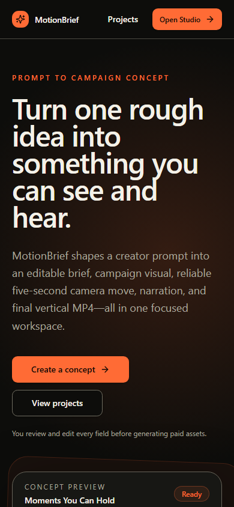

# MotionBrief

MotionBrief turns one rough creator prompt into a production-ready five-second campaign concept: an editable creative brief, a portrait visual, a selectable camera move, narration, and a final vertical MP4.

The workflow keeps the creator in control. Every generated field can be reviewed and edited, paid provider calls require explicit confirmation, and deterministic camera moves make the browser preview immediate and the final render predictable.



<details>
<summary>Mobile layout</summary>



</details>

## What it does

1. **Build the brief** — save a creator prompt, generate campaign strategy and copy, then edit the audience, objective, headline, and creative direction.
2. **Create the visual** — generate a portrait campaign still and choose a push-in, pull-back, pan-left, or pan-right camera move with an instant preview.
3. **Add the voice** — refine a short narration, choose a voice, and generate audio sized for a five-second cut.
4. **Render and export** — preflight the stored assets, render a 9:16 MP4, and copy or download a Markdown creative package with durable media links.

Signed-in users also get a private project library with separately saved concepts, live job progress, and persisted generated assets.

## How the pipeline works

MotionBrief runs on [DeepSpace](https://deep.space), with the UI and Cloudflare Worker shipped as one application.

- **OpenAI / `chat-completion`** turns the initial prompt into structured, editable strategy, copy, and generation prompts.
- **FAL / `run-model`** creates the portrait campaign visual with FLUX.1 Schnell.
- **ElevenLabs / `generate-speech`** records the short narration in the selected voice.
- **Shotstack / `render`** applies the chosen camera move and combines the visual and narration into a five-second 9:16 MP4.

Long-running provider calls execute as resumable background jobs rather than holding open an HTTP request. Job progress is published to the client in real time. Completed provider assets are copied into app-scoped DeepSpace storage so the project does not depend on expiring third-party URLs.

## Data, access, and cost behavior

- Editable project records are private to their owner and synchronized through DeepSpace records.
- Generated media is exported through shareable links. Anyone with one of those links can view that asset.
- Generation requires sign-in.
- Paid provider calls are never triggered by tests or ordinary page loads; the UI presents the action and estimated or fixed cost first.
- If generation succeeds but durable storage fails, the result is retained temporarily so storage can be retried without paying to regenerate it.
- Final renders run a free asset preflight before submitting work to Shotstack.

## Local development

### Prerequisites

- Node.js `22.15+`, `24`, or `26` (see the exact range in `package.json`)
- A DeepSpace account authenticated through the CLI
- Access to the four integrations above for the complete paid pipeline

### Start the app

```sh
npm install
npx deepspace auth whoami --json
npx deepspace auth login # only when signed out
npm run dev
```

The DeepSpace dev server starts Vite and the local Cloudflare Worker runtime together. Do not commit `.dev.vars`; local secrets and provider credentials belong in DeepSpace-managed configuration.

### Verify changes

```sh
npm run validate
npm run lint
npm run format:check
```

Additional suites are available when you need a narrower check:

```sh
npm run test:unit
npm run test:smoke
npm run test:api
npm run test:e2e
```

## Project structure

```text
src/
  pages/                    Route-level React screens
  components/ui/            Local interface primitives
  schemas/                  DeepSpace record schemas
  server/                   HTTP routes and provider pipeline
  lib/                      Motion, narration, asset, and render helpers
  jobs.ts                   Background-job dispatcher
worker.ts                   Cloudflare Worker and Durable Object wiring
tests/                      Smoke, API, collaboration, and end-to-end tests
docs/                       Discovery notes, handoff notes, and screenshots
```

The static landing page lives outside the authenticated app provider boundary. Studio and project routes live under `src/pages/(app)/`, where authentication, records, mutations, jobs, and real-time connections are available.

## Product decision: deterministic motion

The original prototype used generative image-to-video. Live tests were slow, expensive, and inconsistent with the edited motion direction. The finished core workflow uses deterministic camera moves instead: push in, pull back, and horizontal pans.

That choice makes motion previews instant, keeps output aligned with the creator's selection, and gives Shotstack a predictable render specification. Generative motion remains isolated behind a disabled feature path so it can return later as an optional experiment without compromising the reliable workflow.

## Deployment

Run the full verification suite, commit and push the intended changes, and deploy through DeepSpace:

```sh
npm run validate
npm run lint
git commit
git push
npm run deploy
```

This checkout uses GitHub as its source authority. DeepSpace deploys the current local checkout—including uncommitted changes—so inspect `git status` carefully before releasing. Inspect production activity with `npx deepspace activity`, `npx deepspace releases`, and `npx deepspace logs --follow --json`.

## Further documentation

- [Product discovery and implementation notes](docs/motionbrief-discovery.md)
- [Evaluation handoff and verification checklist](docs/submission-notes.md)
